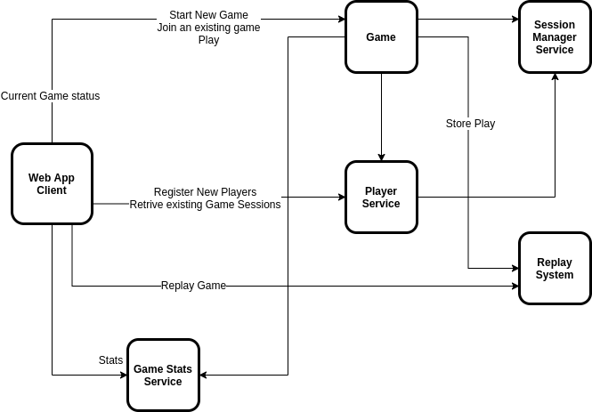

# Introduction
A showcase for a microservice architecture and tools while implementing the board game Codenames: Duet 

# Initial high level architecture details





## Main Components

Brief explanation of the components. A more detail explanation is available at the README in the project module.

All modules will serve their API documentation using RestDocs and make it available at the ```http://COMPONENT_URL/docs/index.html``` url.

### Player Service

A very minimalist approach to register and get player's details

### Game Session Service

TBC


# Tech Stack
- Java 11
- Spring Sleuth
- Documentation generated using RestDocs
- Docker
- K8s
- TBC...

# TODO:
- [ ] Setup a CI/CD solution with CircleCI
- [ ] Host on AWS
- [ ] Build the Terraform scripts
- [ ] Distribute Tracing with Zipkin or Jaeger
- [ ] Build an API Gateway utilizing Spring Cloud
- [ ] Make use of fault tolerance library, such as Hystrix for the Game Stats Service
- [ ] Use Event Storm for the Game Replay Service
- [ ] Use Client-Side load balance using Ribbon


# Building and running the application
## Pre-requisites

TBC

## Building

TBC


## Setting environment variables

TBC


## Running the application

TBC


## Stopping the application

TBC

## Deploying the application on Kubernetes

TBC

# Tips, Tricks and things to remember


## Spring Boot:

@SpringBootApplication is a convenience annotation that adds all of the following:
- @Configuration: Tags the class as a source of bean definitions for the application context.
- @EnableAutoConfiguration: Tells Spring Boot to start adding beans based on classpath settings, other beans, and various property settings.
- @EnableWebMvc: Flags the application as a web application and activates key behaviors, such as setting up a DispatcherServlet. Spring Boot adds it automatically when it sees spring-webmvc on the classpath.
- @ComponentScan: Tells Spring to look for other components, configurations, and services in the the com.example.testingrestdocs package, letting it find the HelloController class.
